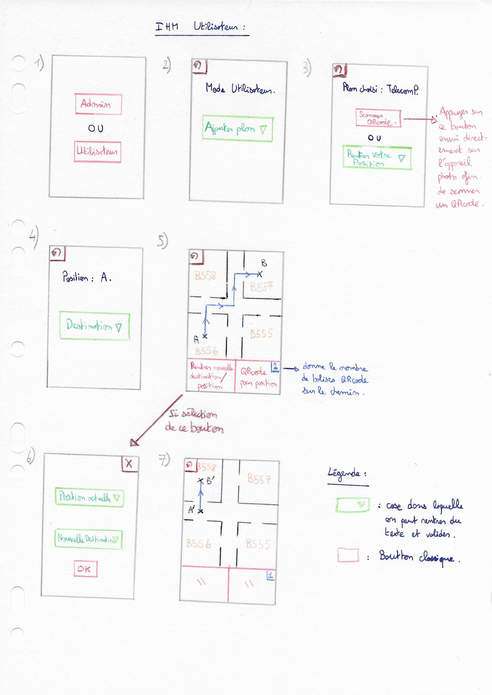

=== Interface Homme-Machine

L'IHM administrateur n'est pas représentée car elle est très similaire, on rajoute seulement la possibilité de rajouter un bâtiment depuis un plan scanné, de rentrer les noms des salles et d'ajouter des balises à QRcode en naviguant sur le plan.