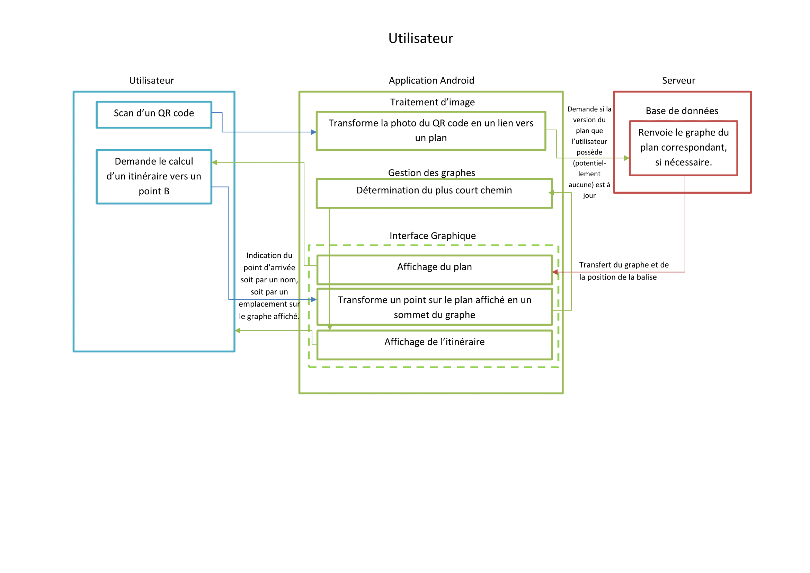
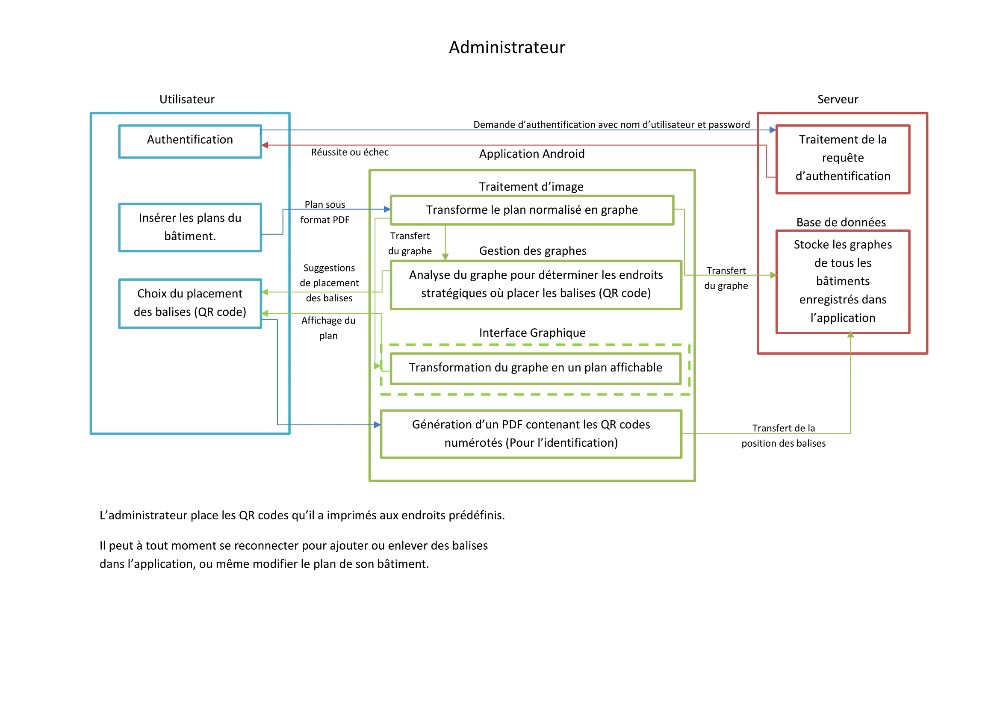

=== Schéma d’architecture

==== Schéma Utilisateur

==== Schéma Administrateur

==== Description des blocs

===== Traitement de l'image

Ce bloc doit transformer les photos de QR code prises par la caméra du smartphone
en un lien exploitable.
Ce bloc doit également transformer un plan scanné normalisé en un graphe.

===== Serveur

Le serveur stocke les plans/graphes ainsi que les positions des balises
(QR codes). Il les restitue à l'application lorsque que celle-ci les demande,
via un lien.

===== Interface Graphique

L'interface graphique affiche le graphe sous forme d'un plan, et affiche l'itinéraire
calculé pour l'utilisateur. Elle permet aussi de transformer les indications de
l'utilisateur en un sommet du graphe.

===== Gestion des graphes

Ce bloc permet de calculer un itinéraire à partir du point de départ et de
potentielles contraintes. Il calcule également les endroits "stratégiques"
où placer les balises, et suggère les emplacements à l'utilisateur.
