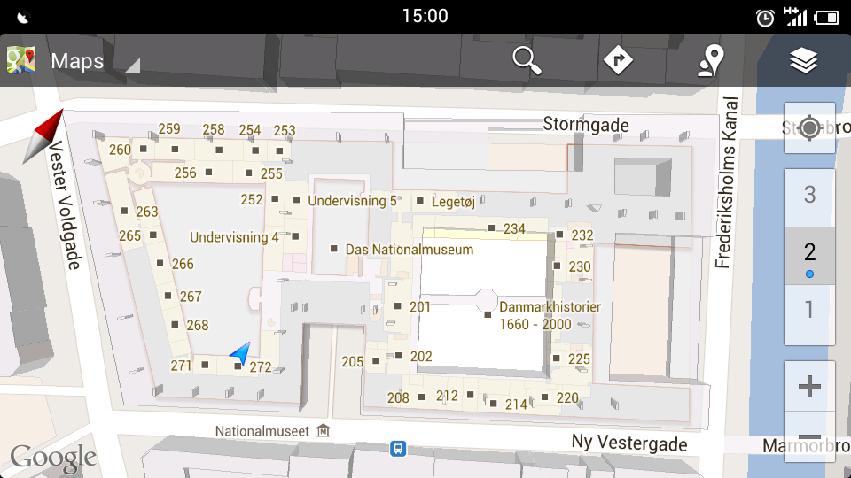

=== Description de l’état de l’art
ifdef::env-gitlab,env-browser[:outfilesuffix: .adoc]

Même si ce n'est pas très connu, Google Maps permet ce type d'affichage de cartes(appelé indoor maps). En fait, ce service existe déjà dans les lieux à grandes affluences (Les halles par exemple).
Cependant, le service de localisation rencontre généralement des problèmes liés aux limitations du GPS. Les QR codes sont donc une alternative.

Lors de l'évènement Digisky organisé à l'école, l'un d'entre nous a pu assister à une conférence proposée par Samuel BOURY, qui présentait son entreprise https://www.ubleam.com[UBLEAM] qui propose une approche de réalité augmentée à l'aide de "Bleam Codes" très proches des QR codes. Ceux-ci s'accolent sur des objets, et une application mobile permet d'en tirer les informations, et de visualiser les offres proposées en rapport avec cet objet.

Monsieur BOURY a évoqué une extension de ces modules qui devrait justement servir à se déplacer suivant un itinéraire dans des hôpitaux. Il est très rapidement passé sur cet aspect dans sa présentation, mais il a particulièrement retenu notre attention puisque l'existence d'un tel projet dans une entreprise privée laisse penser qu'il est réalisable. La navigation proposée se faisait alors par une voix synthétique qui guidait l'utilisateur dans les couloirs de l'hôpital quand celui-ci avait scanné un "Bleam Code" dénotant une localisation, et qu'il indiquait le nom de son médecin.
